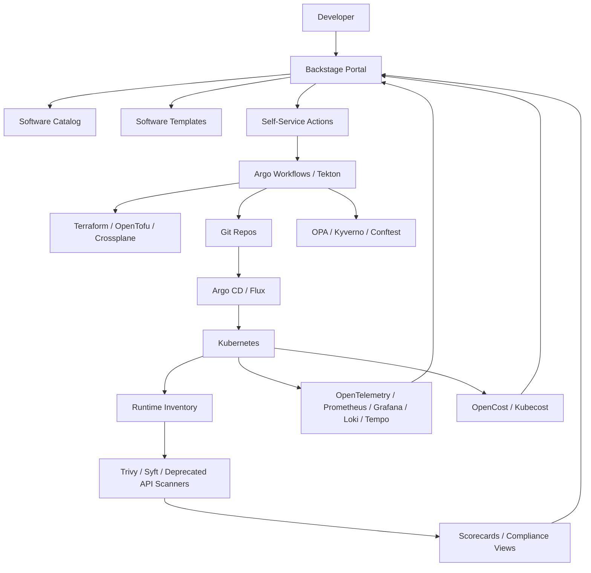
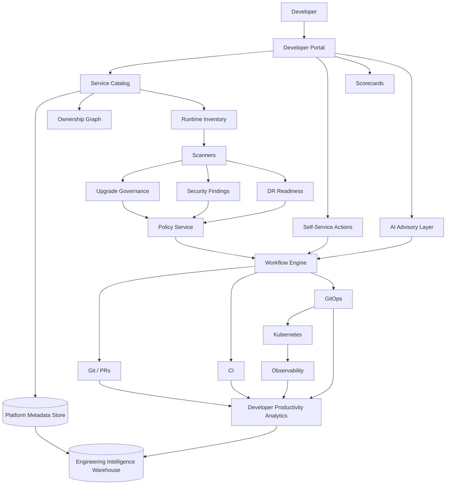

# 2026 Platform Engineering Market Study Guide

## Purpose

This document is a study guide for modern Internal Developer Platform, upgrade governance, AI-powered platform operations, and developer productivity platform discussions.

Use it to answer questions like:

- What has changed in platform engineering over the last year?
- Why is upgrade governance becoming a first-class platform product?
- How do Port, Cortex, and Backstage compare?
- Where does AI fit into platform operations without becoming authoritative?
- What tools are commonly used for developer productivity, build, release, scanning, AI feedback, and SpecOps?

---

# 1. Upgrade Governance as a First-Class Platform Capability

## Core Idea

Upgrade governance is becoming a product capability, not an ad hoc operations activity.

Older model:

```text
Platform team sends upgrade emails
Application teams ignore them
Kubernetes upgrade gets blocked
Security risk accumulates
Leadership has no clear visibility
```

Modern model:

```text
Catalog
+ Policy
+ Workflow
+ Actions
+ Governance
+ Scorecards
+ Automation
= Upgrade Governance Product
```

The platform should continuously answer:

- What services exist?
- Who owns each service?
- What runtime, framework, cluster, template, and dependency versions are they using?
- Which services are non-compliant?
- Which upgrades are platform-owned vs application-owned vs shared?
- What is the enforcement date?
- Who has an exception?
- What deploys should be blocked?
- What work can be automated?

## Why This Matters

Platform modernization is often blocked by long-tail application drift.

Examples:

- Kubernetes cluster upgrade blocked by deprecated APIs.
- Node image upgrade blocked by app runtime compatibility.
- Ingress or service mesh upgrade blocked by custom annotations.
- Base image upgrade blocked by application-owned Dockerfiles.
- Observability agent upgrade blocked by custom sidecars.
- Security deadline blocked by stale libraries.

A Director-level answer should frame this as a product, not as “we’ll coordinate with teams.”

---

## Upgrade Governance Capabilities

### 1. Upgrade Inventory Systems

The platform needs an inventory of:

- Services
- Owners
- Teams
- Repositories
- Runtime versions
- Framework versions
- Container base images
- Kubernetes APIs used
- Helm/Kustomize manifests
- Template versions
- Cluster placement
- Environment placement
- Production criticality
- SLO tier
- Deployment history
- Exception status

The service catalog is the front door, but inventory is broader than the catalog. It also includes scanner results, runtime state, CI metadata, GitOps state, and policy decisions.

### 2. Catalog

The catalog is the system of record for service ownership and metadata.

Minimum fields:

- service_id
- owning_team
- repository
- runtime
- environment
- cluster
- criticality
- cost_center
- SLO tier
- template_version
- upgrade_status
- DR_status
- scorecard_status

### 3. Policy

Policy defines whether a service is compliant.

Example policies:

- Service must not use deprecated Kubernetes APIs.
- Tier-1 service must have a runbook.
- Production service must define owner, pager, and SLO.
- Service must use approved base image.
- Service must not deploy with critical vulnerabilities.
- Service must be on supported framework version by date X.

Policy modes:

- Advisory
- Warning
- Exception required
- Blocking

### 4. Workflow

Workflow turns governance into action.

Examples:

- Create upgrade campaign.
- Scan all services.
- Notify owners.
- Open automated pull requests.
- Track exceptions.
- Block production deployment after deadline.
- Escalate to manager.
- Mark campaign complete after compliance threshold is met.

### 5. Actions

Actions are developer-facing workflows.

Examples:

- “Upgrade this service to template v3.”
- “Create a migration PR.”
- “Request exception.”
- “Run compatibility test.”
- “Schedule DR test.”
- “Generate missing runbook.”
- “Create SLO from standard template.”

### 6. Governance

Governance is the operating model.

It defines:

- Required standards
- Enforcement dates
- Exception approval
- Risk acceptance
- Escalation path
- Reporting cadence
- Ownership boundaries

### 7. Scorecards

Scorecards make compliance visible.

Example scorecard dimensions:

- Ownership complete
- SLO defined
- Runbook exists
- Supported runtime
- No critical vulnerabilities
- Template current
- DR profile defined
- Last DR test passed
- Production deploy policy compliant

### 8. Automation

Automation reduces platform toil.

Examples:

- Auto-detect deprecated APIs.
- Auto-create upgrade PRs.
- Auto-tag non-compliant services.
- Auto-notify owner channels.
- Auto-create Jira tickets.
- Auto-block deploys after deadline.
- Auto-retest compliance after merge.

---

## Upgrade Governance Lifecycle

```text
IDENTIFIED
  -> IMPACT_ASSESSED
  -> ANNOUNCED
  -> ADVISORY
  -> DEADLINE_SET
  -> ENFORCING
  -> COMPLETE
  -> EXCEPTION_GRANTED
```

### IDENTIFIED

An upgrade need is discovered.

Examples:

- Kubernetes version EOL.
- Critical CVE.
- Deprecated API.
- Unsupported language runtime.
- Required base image migration.
- Security standard change.

### IMPACT_ASSESSED

The platform determines which services are impacted.

Signals:

- Git scanning
- GitOps manifests
- Runtime inventory
- CI metadata
- SBOM/SCA output
- Cluster API discovery
- Service catalog metadata

### ANNOUNCED

Owners are notified.

Outputs:

- Service list
- Required action
- Deadline
- Migration guide
- Support channel
- Exception path

### ADVISORY

Teams receive warnings but are not blocked.

Example:

- CI warning
- Scorecard degradation
- Catalog banner
- Slack notification

### DEADLINE_SET

Leadership-approved enforcement date exists.

### ENFORCING

Non-compliant services are blocked or require exception.

Examples:

- Block production deploys.
- Block new service creation on old template.
- Block environment creation.
- Require break-glass approval.

### COMPLETE

Upgrade campaign is done.

### EXCEPTION_GRANTED

Temporary exception exists with expiration and compensating control.

---

# 2. Port vs Cortex vs Backstage

## High-Level Positioning

| Tool | Best Framing | Primary Buyer | Core Strength |
|---|---|---|---|
| Port | SaaS internal developer portal with flexible data model, actions, workflows, scorecards, and AI agents | Platform engineering | Custom platform product layer |
| Cortex | SaaS engineering operations / internal developer portal with scorecards, ownership, initiatives, AI coding governance, and EngOps workflows | Engineering leadership + platform | Scorecards, standards, ownership, engineering operational maturity |
| Backstage | Open-source framework for building developer portals | Platform engineering teams willing to build | Extensible catalog, plugins, templates, docs, OSS ecosystem |

## Open Source vs Commercial

| Tool | Open Source? | Pricing Signal | Notes |
|---|---:|---|---|
| Port | No, SaaS/commercial | Public pricing: free tier up to 15 seats, then paid seat-based tiers, with enterprise custom pricing | Good for teams that want a hosted, configurable platform product |
| Cortex | No, SaaS/commercial | Custom pricing | Good for companies that want a managed EngOps/developer portal product |
| Backstage | Yes | Open source framework; cost is engineering time, hosting, maintenance, plugin development, security, RBAC, upgrades | Good for teams with strong platform engineering capacity |

## Feature Comparison

| Capability | Port | Cortex | Backstage |
|---|---|---|---|
| Software catalog | Strong | Strong | Strong core capability |
| Custom data model | Very strong; blueprint-style modeling | Strong but more product-shaped | Possible but requires engineering/plugin work |
| Scorecards | Strong built-in | Strong built-in | Available through plugins/custom work |
| Self-service actions | Strong | Strong | Scaffolder/templates/plugins |
| Workflow orchestration | Strong product focus | Strong product focus | Requires plugins/integration/custom orchestration |
| Upgrade campaigns | Can model with catalog, scorecards, workflows, actions | Strong fit through scorecards, initiatives, ownership | Build using catalog/plugins/policies/custom workflows |
| Runtime compliance dashboards | Strong if modeled correctly | Strong | Build/customize |
| Deprecated API tracking | Requires scanner integration | Requires scanner integration | Requires plugin/integration |
| Exception management | Can model as entities/workflows | Strong fit for initiatives/scorecards | Custom |
| AI enablement | Explicit AI agents/context lake positioning | Explicit AI-powered IDP/EngOps positioning | AI depends on plugins/custom extensions |
| Governance | Strong | Strong | Possible, but you build operating model and enforcement |
| Extensibility | High through platform configuration | High through SaaS features/integrations | Highest code-level extensibility |
| Time to value | Faster than building | Faster than building | Slower unless already invested |
| Operational burden | Lower | Lower | Higher |
| Vendor lock-in | Medium/high | Medium/high | Low on framework, higher on custom implementation |
| Best use case | Platform team wants configurable product quickly | Leadership wants engineering standards, maturity, and operational visibility | Strong platform team wants maximum control and OSS foundation |

---

## Canonical Mapping to Your Design

| Your Design Concept | Port | Cortex | Backstage |
|---|---|---|---|
| Service Catalog Service | Software Catalog / Context Lake | Catalog | Software Catalog |
| Golden Path Template Service | Actions + workflows + templates | Self-service workflows/templates | Scaffolder / Software Templates |
| Policy Service | Scorecards + rules + access controls | Scorecards + initiatives + standards | Plugins/custom policy integration |
| Workflow Engine | Workflow orchestrator | Workflows/automation | External workflow engine or plugin |
| Upgrade Governance Service | Modeled as entities, scorecards, workflows, actions | Strong fit through scorecards/initiatives | Custom plugin/model |
| DR Readiness Service | Modeled as entities and scorecards | Scorecards/initiatives | Custom plugin/model |
| Adoption Metrics Service | Scorecards, dashboards | Reports/scorecards | Plugins/custom analytics |
| Developer Portal UI | Interface designer | Cortex portal | Backstage UI |
| Actions | Self-service actions | Automations/self-service | Scaffolder/actions |
| Scorecards | Built-in | Built-in | Plugin/custom |
| AI Platform Operations | AI agents over context | AI-powered EngOps / coding standards | Custom AI plugins/integrations |

---

## Interview Answer: Which Would You Choose?

### If asked: “Would you use Backstage?”

A strong answer:

> Backstage is a strong open-source foundation for a developer portal, especially for catalog, docs, templates, and plugin extensibility. But I would not assume Backstage alone solves platform governance. For upgrade governance, DR readiness, scorecards, enforcement workflows, and policy-driven deployment gates, I still need a control plane behind the portal. If the company has strong platform engineering capacity, Backstage is a good foundation. If speed and managed workflows matter more, I would evaluate Port or Cortex.

### If asked: “Port vs Cortex?”

A strong answer:

> I would evaluate Port when I want a highly flexible platform product model with custom entities, workflows, actions, scorecards, and AI agents. I would evaluate Cortex when the organization wants a more opinionated engineering operations platform focused on ownership, standards, scorecards, initiatives, and maturity. Either can support upgrade governance if we model services, upgrade requirements, exceptions, and policy outcomes correctly.

### If asked: “What is the biggest risk?”

Answer:

> The biggest risk is treating the portal as the platform. The portal is only the experience layer. The real platform value comes from authoritative metadata, policy, workflow orchestration, enforcement, and operational ownership.

---

# 3. AI-Powered Platform Operations

## Core Idea

AI should be advisory, not authoritative.

AI can recommend, summarize, detect, and draft, but production decisions should still be enforced through deterministic policy, workflow state, approvals, and audit records.

Good framing:

```text
AI suggests.
Policy decides.
Workflow executes.
Humans approve high-risk changes.
Metadata remains authoritative.
```

---

## AI-Powered Platform Operations Use Cases

### 1. Upgrade Recommendations

AI can recommend:

- Which services are affected by an upgrade.
- What files need to change.
- Which APIs are deprecated.
- Which migration guide applies.
- Which teams are blocked.
- Which PRs can be generated automatically.

Authoritative systems:

- Catalog
- Source repo
- Scanner results
- Policy Service
- Upgrade Governance Service

AI role:

- Summarize impact.
- Draft migration plan.
- Generate PR.
- Explain risk.

### 2. Ownership Inference

AI can infer ownership from:

- Git commit history
- CODEOWNERS
- PagerDuty schedules
- Slack channels
- Incident history
- Deployment history
- Repo metadata
- Catalog metadata

Authoritative owner should still be confirmed in the catalog.

AI role:

- Suggest likely owner.
- Flag stale ownership.
- Recommend owner update.

### 3. Missing Runbook Detection

AI can detect:

- Services with incidents but no runbook.
- Runbooks that do not mention common failure modes.
- Runbooks that lack rollback steps.
- Runbooks that do not include dashboards or alerts.
- Runbooks that are stale based on service changes.

AI role:

- Draft missing runbook.
- Summarize incidents into runbook updates.
- Suggest missing sections.

### 4. Cost Optimization Suggestions

AI can suggest:

- Rightsizing workloads.
- Removing idle environments.
- Reducing telemetry volume.
- Adjusting autoscaling.
- Moving data to lower retention tiers.
- Consolidating underused clusters.

Authoritative systems:

- Cloud billing
- Kubernetes metrics
- Cost allocation service
- Observability systems

AI role:

- Explain cost drivers.
- Recommend first optimization.
- Draft ticket or PR.

### 5. SLO Recommendations

AI can suggest SLOs from:

- Service criticality
- Historical latency
- Error rate
- Incident history
- Dependency criticality
- User journey mapping

Human/platform governance must approve SLOs.

AI role:

- Recommend SLO baseline.
- Detect unrealistic SLOs.
- Explain error budget burn.

### 6. Incident Summarization

AI can summarize:

- Timeline
- Alerts
- Logs
- Traces
- Deployments
- Suspected root cause
- Customer impact
- Follow-up actions

AI should not be the only evidence source.

Authoritative systems:

- Incident management system
- Observability backend
- Deployment history
- Audit records

### 7. Service Dependency Discovery

AI can infer dependencies from:

- Traces
- Network flows
- API specs
- Repository references
- Kubernetes service calls
- Configuration
- Logs

Use AI as a helper. Dependency graph should be validated through telemetry and service metadata.

---

## Commonly Adopted Commercial Products

### Internal Developer Portal / Platform Ops

Commercial / managed products:

- Port
- Cortex
- Roadie
- OpsLevel
- Humanitec
- Atlassian Compass
- ServiceNow DevOps / ITOM integrations

Open-source / self-hosted building blocks:

- Backstage
- Kratix
- Crossplane
- Argo CD
- Flux
- Argo Workflows
- Tekton
- Open Policy Agent / Gatekeeper
- Kyverno
- Terraform / OpenTofu
- CNOE
- OpenChoreo
- Humanitec Score, if using Score as a workload specification model

Important framing: open-source IDP usually means assembling a platform from components. Backstage gives the portal/catalog experience, but the broader platform needs provisioning, GitOps, policy, workflow, secrets, observability, scorecards, and governance integrations.

---

## Open-Source Internal Developer Portal / Platform Ops Tools

Open-source platform engineering is less about one tool replacing Port or Cortex and more about composing a control plane from multiple CNCF-style building blocks.

### Open-Source IDP Capability Map

| Capability | Common Open-Source Tools | What They Own | Notes |
|---|---|---|---|
| Portal / catalog | Backstage | Developer portal, software catalog, TechDocs, templates, plugins | Best-known OSS portal framework; does not by itself provision or operate infrastructure |
| Platform composition / platform orchestration | Kratix, Crossplane | Platform APIs, resource provisioning, platform promises/compositions | Useful for defining higher-level platform abstractions over Kubernetes/cloud resources |
| GitOps deployment | Argo CD, Flux | Desired-state reconciliation from Git to clusters | Owns deployment convergence, drift detection, sync status |
| Workflow / actions execution | Argo Workflows, Tekton, GitHub Actions, Jenkins | Multi-step automation, CI jobs, self-service action backends | Often sits behind Backstage software templates or portal actions |
| Policy / governance | Open Policy Agent, Gatekeeper, Kyverno, Conftest | Admission control, policy checks, config validation | Needed for guardrails and enforcement; can support upgrade blocking |
| Infrastructure as Code | Terraform, OpenTofu, Crossplane | Cloud resources, platform dependencies, managed services | Often used behind self-service workflows |
| Secrets | External Secrets Operator, Sealed Secrets, SOPS | Secret sync and secret delivery patterns | The portal should not store secrets directly |
| Observability | OpenTelemetry, Prometheus, Grafana, Loki, Tempo, Jaeger | Metrics, logs, traces, dashboards | Portal should link to or summarize, not duplicate all telemetry |
| Cost / FinOps | OpenCost, Kubecost community | Kubernetes cost allocation | Can feed service cost scorecards |
| Security scanning | Trivy, Grype, Syft, OWASP Dependency-Track, OpenSSF Scorecard, Semgrep Community | SBOM, vulnerabilities, dependency risk, repo hygiene | Feeds compliance dashboards and scorecards |
| Progressive delivery | Argo Rollouts, Flagger | Canary, blue/green, automated rollout analysis | Important for safe deployment standards |
| DR / backup enablement | Velero, Kasten K10 if commercial is acceptable, LitmusChaos, Chaos Mesh | Backup/restore, chaos tests, recovery validation support | Platform can enable DR, but application teams must validate correctness |
| Reference IDP stacks | CNOE, OpenChoreo | Pre-integrated platform engineering stacks | Useful to know as examples of OSS-first IDP packaging |

### Backstage

Best use:

- Developer portal front door.
- Service catalog.
- TechDocs.
- Software templates.
- Plugin-based integrations.
- Kubernetes, CI/CD, docs, API, and ownership visibility.

What it does not own by default:

- Runtime state.
- Deployment orchestration.
- Policy enforcement.
- Upgrade compliance.
- DR validation.
- Cost allocation.
- Workflow durability.

Interview framing:

> Backstage is a strong open-source portal framework, but it is not the full platform control plane. I would pair it with GitOps, workflow automation, policy engines, scanners, and metadata governance.

### Kratix

Best use:

- Building platform APIs and higher-level platform abstractions.
- Exposing self-service capabilities as Kubernetes-native resources.
- Letting platform teams define “promises” that developers can consume.

Useful mental model:

```text
Developer requests capability
→ Platform API/resource is created
→ Kratix pipeline processes request
→ Platform provisions resources across destinations
```

Interview framing:

> Kratix is useful when the platform team wants to expose opinionated self-service capabilities, not just a portal. It helps turn platform standards into consumable APIs.

### Crossplane

Best use:

- Provisioning cloud resources through Kubernetes APIs.
- Creating composite resources like `PostgresInstance`, `ServiceEnvironment`, or `ApplicationInfrastructure`.
- Standardizing cloud infrastructure behind platform abstractions.

Strength:

- Strong fit for platform-owned infrastructure provisioning.

Risk:

- Requires careful ownership boundaries and lifecycle management because cloud resources become Kubernetes-managed objects.

Interview framing:

> Crossplane is strong when I want Kubernetes-native control-plane behavior for cloud infrastructure, but I still need catalog metadata, policy, workflows, and operational guardrails around it.

### Argo CD / Flux

Best use:

- GitOps reconciliation.
- Desired-state deployment.
- Drift detection.
- Cluster/app sync status.

Ownership boundary:

- Git owns desired state.
- Argo CD / Flux owns reconciliation.
- Kubernetes owns actual runtime state.
- Platform metadata tracks deployment lifecycle and ownership.

Interview framing:

> GitOps is the right default for production because it creates durable desired state, reviewable history, and safer rollback. The portal should trigger workflows that update Git, not mutate production clusters directly.

### Argo Workflows / Tekton

Best use:

- Running workflow-backed portal actions.
- CI/CD tasks.
- Upgrade automation.
- Migration jobs.
- DR test execution.

Examples:

- Generate a service from a template.
- Open a migration PR.
- Run deprecated API scanner.
- Run compatibility tests.
- Execute backup/restore test.

Interview framing:

> Self-service actions need a durable execution backend. A portal click should create a workflow record, execute through a workflow engine, and update authoritative state as each step completes.

### Open Policy Agent / Gatekeeper / Kyverno

Best use:

- Kubernetes admission control.
- Config validation.
- Policy-as-code.
- Deployment guardrails.
- Upgrade enforcement.

Examples:

- Block deprecated Kubernetes APIs.
- Require labels and ownership metadata.
- Enforce image provenance.
- Require resource limits.
- Block privileged containers.
- Require production services to have SLO and runbook links.

Interview framing:

> Policy should exist both before deployment and at admission time. CI/CD policy catches issues early; admission policy protects the cluster. The platform should surface policy results in the catalog and scorecards.

### Terraform / OpenTofu

Best use:

- Cloud resource provisioning.
- Shared platform infrastructure.
- Managed databases, queues, DNS, IAM, and cloud services.

How it fits:

- Portal action starts workflow.
- Workflow opens or applies IaC change.
- Metadata DB tracks request and ownership.
- Policy validates plan before apply.

Interview framing:

> Terraform or OpenTofu can be the provisioning backend, but they should sit behind platform workflows, policy, approvals, and audit rather than being used manually by every team.

### CNOE

Best use:

- Reference stack for building an OSS internal developer platform.
- Combining Backstage, GitOps, workflows, and platform tooling into a more complete starting point.

Interview framing:

> CNOE is useful to know because it reflects the industry pattern: OSS IDPs are assembled from multiple tools, with Backstage as the front door and GitOps/workflow/policy tools behind it.

### OpenChoreo

Best use:

- Open-source, Kubernetes-native IDP packaging.
- Application platform abstraction over Kubernetes.
- Opinionated developer experience using cloud-native components.

Interview framing:

> OpenChoreo is another example of the market moving from a portal-only view toward packaged platform capabilities built on Kubernetes and CNCF tooling.

### OSS IDP Reference Architecture



### OSS vs Commercial IDP Tradeoff

| Dimension | OSS-First IDP | Commercial IDP |
|---|---|---|
| Time to value | Slower | Faster |
| Customization | Highest | Medium/high depending on product |
| Operational burden | High | Lower |
| Engineering staffing | Requires dedicated platform engineers | Still needs platform ownership, but less build burden |
| Governance workflows | Usually custom-built | Often built-in or configurable |
| Scorecards | Usually custom/plugin-based | Usually built-in |
| Upgrade governance | Build from catalog + scanners + policy + workflow | Model/configure using product capabilities |
| AI features | Mostly custom integrations | Increasingly built in |
| Vendor lock-in | Lower product lock-in, higher internal implementation complexity | Higher vendor dependence |
| Best fit | Strong platform team, high customization needs, OSS preference | Need faster rollout, managed UX, built-in workflows and scorecards |

### Director-Level Takeaway

> For an OSS-first IDP, I would not present a single tool as the answer. I would describe a composed platform: Backstage for portal/catalog, Argo CD or Flux for GitOps, Crossplane or Terraform/OpenTofu for provisioning, Argo Workflows or Tekton for actions, OPA/Kyverno for policy, OpenTelemetry/Prometheus/Grafana for observability, OpenCost for cost, and scanners like Trivy/Syft/OpenSSF Scorecard for compliance. The hard part is not installing tools; it is defining ownership, metadata, workflows, enforcement, and adoption.

### Observability / AIOps

- Datadog
- New Relic
- Dynatrace
- Grafana Cloud
- Splunk Observability
- PagerDuty AIOps
- Rootly
- incident.io
- FireHydrant
- BigPanda
- Moogsoft-style event correlation platforms

### Cost Optimization / FinOps

- Kubecost / OpenCost
- CloudHealth
- CloudZero
- Harness Cloud Cost Management
- Datadog Cloud Cost Management
- AWS Cost Explorer / Compute Optimizer
- GCP Recommender
- Azure Advisor

### AI Coding / AI SDLC

- GitHub Copilot
- GitHub Agent HQ
- Cursor
- Windsurf
- Claude Code
- OpenAI Codex
- Google Jules
- Sourcegraph Cody
- Devin
- Augment Code
- JetBrains AI

---

## Open Source Tools

### Observability Foundation

- OpenTelemetry
- Prometheus
- Grafana
- Loki
- Tempo
- Jaeger
- OpenObserve
- Netdata

### Reliability / SLO

- Sloth
- Pyrra
- Nobl9 Agent integrations, if commercial SLO platform is used
- Grafana SLO tooling
- OpenSLO specification

### Cost

- OpenCost
- Kubecost free/community options

### Security / Compliance / Scanning

- OpenSSF Scorecard
- OWASP Dependency-Track
- Trivy
- Grype
- Syft
- Cosign
- SLSA provenance tooling
- Sigstore
- Semgrep Community
- CodeQL for open-source/GitHub workflows
- Dependabot

### Policy

- Open Policy Agent
- Kyverno
- Conftest
- Gatekeeper

### Chaos / DR Testing

- LitmusChaos
- Chaos Mesh
- Velero
- Argo CD
- Flux
- Kasten K10, if commercial backup is acceptable

### AI / SpecOps

- GitHub Spec Kit
- Aider
- OpenCode
- Continue
- Cline
- aider-based workflows
- llms.txt / AGENTS.md / skill.md style repository instructions

---

## Interview Positioning for AI Platform Ops

Say:

> I would use AI as an advisory layer over the platform control plane. It can recommend upgrades, infer stale ownership, draft runbooks, summarize incidents, and suggest cost or SLO improvements. But it should not be authoritative. The source of truth remains the catalog, policy service, workflow state, deployment history, observability data, and audit records.

Avoid saying:

> The AI agent will automatically fix everything.

Better:

> For low-risk changes, AI can draft PRs or trigger approved actions. For production-impacting changes, the platform should require deterministic policy checks, owner approval, and auditability.

---

# 4. Developer Productivity Platforms

## Core Idea

Developer productivity platforms are moving beyond DORA dashboards.

Modern platforms measure:

- Build health
- Deployment flow
- Release quality
- Code review bottlenecks
- Security and vulnerability burden
- Code quality
- AI adoption
- AI effectiveness
- Golden path adoption
- Platform friction
- Spec-to-code flow
- Developer experience surveys

The market is moving toward engineering intelligence: combining workflow data, code data, incident data, platform metadata, and AI adoption data.

Atlassian’s agreement to acquire DX for about $1B is a major market signal that developer intelligence and AI investment measurement are becoming strategic enterprise capabilities.

---

## Commonly Adopted Developer Productivity Products

| Category | Products |
|---|---|
| Engineering intelligence | DX, LinearB, Jellyfish, Swarmia, Faros AI, Waydev, Pluralsight Flow |
| Planning and issue flow | Jira, Linear, Azure DevOps, Shortcut |
| Source control | GitHub, GitLab, Bitbucket |
| Build/CI | GitHub Actions, GitLab CI, CircleCI, Buildkite, Jenkins, TeamCity |
| Release/deployment | Argo CD, Flux, Harness, Spinnaker, Octopus Deploy, LaunchDarkly |
| Code quality | SonarQube/SonarCloud, CodeClimate, Codacy |
| Security scanning | Snyk, Semgrep, GitHub Advanced Security, Checkmarx, Veracode, Endor Labs |
| Coverage | Codecov, Coveralls, SonarQube coverage integration |
| AI coding | GitHub Copilot, Cursor, Windsurf, Claude Code, Codex, Devin, Augment |
| SpecOps / Spec-driven development | GitHub Spec Kit, repository instructions, AGENTS.md, llms.txt, MCP-based tools |

---

## Open Source Developer Productivity Stack

### Build

- Jenkins
- Tekton
- Drone CI
- Dagger
- Argo Workflows
- GitHub Actions for public/open-source repos

### Deploy / Release

- Argo CD
- Flux
- Flagger
- Argo Rollouts
- Helm
- Kustomize
- Spinnaker
- Keptn

### Scan / Code Coverage / Vulnerabilities / Code Smells

- SonarQube Community
- Semgrep Community
- CodeQL
- Trivy
- Grype
- Syft
- OWASP Dependency-Track
- OpenSSF Scorecard
- Dependabot
- JaCoCo
- Istanbul / nyc
- coverage.py
- gcov / lcov

### AI Integration and Feedback

- Continue
- Aider
- OpenCode
- Cline
- GitHub Spec Kit
- OpenAI-compatible local agent workflows
- MCP servers for internal tools
- Repository-level instructions such as AGENTS.md, skill.md, llms.txt

### Metrics / Engineering Intelligence

Fully open-source engineering intelligence is less mature than commercial platforms, but useful building blocks include:

- Apache DevLake
- GrimoireLab
- OpenTelemetry
- Prometheus / Grafana
- GitHub/GitLab APIs
- DORA metric dashboards
- Custom warehouse models over Git, CI, deploy, incident, and issue data

---

## Developer Productivity Capability Map

### Build

Measures:

- Build duration
- Queue time
- Failure rate
- Flaky test rate
- Cache hit rate
- CI cost
- Developer wait time

Common tools:

- GitHub Actions
- GitLab CI
- Buildkite
- CircleCI
- Jenkins
- Dagger
- Tekton

Director-level point:

> Build productivity is not just CI success. It is developer wait time, flaky test burden, cost, and whether build failures are actionable.

---

### Deploy / Releasing

Measures:

- Deployment frequency
- Lead time
- Change failure rate
- Rollback rate
- Time to production
- Approval wait time
- Canary failure rate
- Environment drift

Common tools:

- Argo CD
- Flux
- Harness
- Spinnaker
- LaunchDarkly
- Argo Rollouts
- Flagger

Director-level point:

> Release productivity should be measured alongside reliability. Faster deploys are only good if rollback, blast-radius control, and verification are mature.

---

### Scan / Code Coverage / Vulnerabilities / Code Smells

Measures:

- Critical vulnerabilities
- Reachable vulnerabilities
- SAST findings
- Code smells
- Coverage trend
- Security debt age
- Mean time to remediate
- False positive rate

Common tools:

- SonarQube / SonarCloud
- Snyk
- Semgrep
- GitHub Advanced Security
- CodeQL
- Checkmarx
- Veracode
- Endor Labs
- Trivy
- OWASP Dependency-Track

Director-level point:

> Scanning must be tuned for signal. A platform that creates thousands of unactionable findings will be bypassed. The product goal is risk reduction, not scanner volume.

---

### AI Integration and Feedback

Measures:

- AI tool adoption
- AI-assisted PR percentage
- AI-generated code review findings
- Acceptance rate
- Rework rate
- Test coverage of AI-assisted code
- Security findings in AI-assisted code
- Developer satisfaction
- Time saved by task type

Common tools:

- GitHub Copilot
- GitHub Agent HQ
- Cursor
- Windsurf
- Claude Code
- OpenAI Codex
- Devin
- Augment
- Sourcegraph Cody

Director-level point:

> AI adoption should be governed like any other engineering platform. Measure productivity, quality, security, and developer trust. Do not measure only lines of code or prompt volume.

---

### SpecOps / Spec-Driven Development

SpecOps means making specifications, acceptance criteria, architectural constraints, and repo instructions part of the AI-assisted SDLC.

Capabilities:

- Feature spec generation
- Technical plan generation
- Task decomposition
- Acceptance criteria
- Test plan generation
- Agent instructions
- PR validation against spec
- Feedback loop from implementation to spec

Tools / patterns:

- GitHub Spec Kit
- AGENTS.md
- llms.txt
- skill.md
- MCP servers
- GitHub Issues + AI agents
- Cursor rules
- Claude Code project instructions
- OpenCode instructions
- Repo-level architecture docs

Director-level point:

> SpecOps is how organizations avoid vibe coding at scale. It turns AI from an individual productivity tool into a governed SDLC capability.

---

# 5. Canonical Architecture for Modern Platform Engineering



## Architecture Interpretation

- Portal is the user experience.
- Catalog owns service metadata and ownership.
- Inventory and scanners detect runtime reality.
- Scorecards expose compliance and maturity.
- Policy decides what is allowed.
- Workflow executes controlled actions.
- AI advises, drafts, summarizes, and recommends.
- GitOps owns desired runtime state.
- Kubernetes owns actual runtime state.
- Engineering intelligence combines Git, CI, deploy, incident, platform, and AI adoption data.

---

# 6. What to Say in Interviews

## Strong Summary

> The market is moving from developer portals to platform control planes. A portal by itself is not enough. Modern platforms need catalog, policy, workflow, actions, scorecards, automation, and AI-assisted operations. Upgrade governance is a good example: it requires service inventory, ownership, scanners, deadlines, exception management, and deployment enforcement. AI can improve recommendations, ownership inference, runbook quality, incident summaries, and cost/SLO suggestions, but it should remain advisory. The authoritative systems are still catalog, policy, workflow state, deployment state, observability, and audit logs.

## If Asked About Port / Cortex / Backstage

> Backstage is the open-source framework and gives maximum control, but the team must build and operate more of the governance and workflow layer. Port and Cortex are commercial products that reduce time to value. Port is strong where the platform team wants a flexible data model, workflows, actions, scorecards, and AI agents. Cortex is strong where engineering leadership wants scorecards, ownership, standards, and engineering operational maturity. I would choose based on build-vs-buy, customization needs, governance requirements, and platform team capacity.

## If Asked About AI

> I would use AI as an assistant over the platform control plane, not as the control plane itself. It can draft upgrade PRs, summarize incidents, infer ownership, and suggest SLO or cost improvements. But production-impacting decisions should flow through deterministic policy, workflow state, owner approval, and audit.

## If Asked About Developer Productivity

> I would not use developer productivity metrics as surveillance. I would use them to identify system bottlenecks: slow builds, flaky tests, review delays, deployment friction, platform adoption gaps, and high toil. The best metrics combine DORA, SPACE-style developer experience, platform adoption, quality signals, and AI effectiveness.

---

# 7. Study Checklist

## Upgrade Governance

Know how to explain:

- Upgrade inventory
- Deprecated API scanning
- Runtime compliance dashboards
- Exception management
- Enforcement workflows
- Advisory vs blocking policy
- Platform-owned vs application-owned vs shared upgrades
- Why this is a product capability

## Port / Cortex / Backstage / OSS IDP Stack

Know how to compare:

- SaaS vs open source
- Portal vs platform control plane
- Catalog
- Scorecards
- Actions
- Workflows
- AI
- Pricing model
- Operational burden
- Build vs buy
- Backstage plus Argo CD/Flux plus Crossplane/Terraform/OpenTofu plus OPA/Kyverno plus OpenTelemetry/Grafana as a composed OSS platform

## AI Platform Operations

Know examples:

- Upgrade recommendation
- Ownership inference
- Missing runbook detection
- Cost optimization
- SLO recommendation
- Incident summarization
- Dependency discovery

Know the rule:

```text
AI suggests.
Policy decides.
Workflow executes.
Audit records.
```

## Developer Productivity Platforms

Know categories:

- Build
- Deploy/release
- Scan/security/coverage
- Engineering intelligence
- AI adoption
- SpecOps

Know common tools:

- DX
- LinearB
- Jellyfish
- Swarmia
- Faros AI
- GitHub Copilot
- GitHub Spec Kit
- SonarQube
- Snyk
- Semgrep
- Argo CD
- GitHub Actions

---

# 8. Sources and Current Market Signals

- Port positions itself around a Context Lake, Software Catalog, Actions, AI Agents, Scorecards, Access Controls, Workflows, and Interface Designer. Its public pricing page lists a free tier, seat-based paid tiers, and enterprise custom pricing.
- Cortex positions itself as an AI-powered internal developer portal / EngOps platform and describes developer self-service, service creation savings, deployment frequency, and MTTR improvements.
- Backstage is an open-source CNCF Incubating framework for building developer portals, centered on a software catalog and plugin ecosystem.
- Current OSS-first IDP patterns commonly compose Backstage with GitOps tools such as Argo CD or Flux, provisioning tools such as Crossplane or Terraform/OpenTofu, policy tools such as OPA/Gatekeeper or Kyverno, workflow tools such as Argo Workflows or Tekton, and observability tools such as OpenTelemetry, Prometheus, and Grafana.
- CNOE and OpenChoreo are useful examples of OSS-first or Kubernetes-native approaches that package multiple platform engineering capabilities rather than treating the portal as the entire platform.
- The market is increasingly describing developer portals as only the interface layer; the platform/control-plane layer includes provisioning, workflow, policy, and operational governance.
- Atlassian’s announced acquisition of DX is a strong signal that developer intelligence and AI investment measurement are becoming board-level concerns.
- GitHub Spec Kit and GitHub Agent HQ are strong signals that SpecOps and multi-agent SDLC governance are becoming part of mainstream developer workflows.

Source references captured during creation:
- Port pricing and capabilities: https://www.port.io/pricing
- Port platform positioning: https://www.port.io/
- Cortex pricing: https://www.cortex.io/pricing
- Cortex platform positioning: https://www.cortex.io/
- Backstage official site: https://backstage.io/
- Backstage CNCF project page: https://www.cncf.io/projects/backstage/
- PlatformEngineering.org portal capability summary: https://platformengineering.org/blog/what-is-an-internal-developer-portal
- Northflank internal developer portal comparison: https://northflank.com/blog/top-internal-developer-portals
- WSO2 OpenChoreo / CNCF IDP stack article: https://wso2.com/library/blogs/building-enterprise-grade-self-serviceable-internal-developer-platform-part-1/
- CNOE project: https://cnoe.io/
- InternalDeveloperPlatform.org portal definition: https://internaldeveloperplatform.org/developer-portals/
- GitHub Spec Kit: https://github.com/github/spec-kit
- GitHub Spec Kit announcement: https://github.blog/ai-and-ml/generative-ai/spec-driven-development-with-ai-get-started-with-a-new-open-source-toolkit/
- Atlassian / DX acquisition reporting: https://www.reuters.com/technology/atlassian-acquire-dx-1-billion-deal-2025-09-18/
