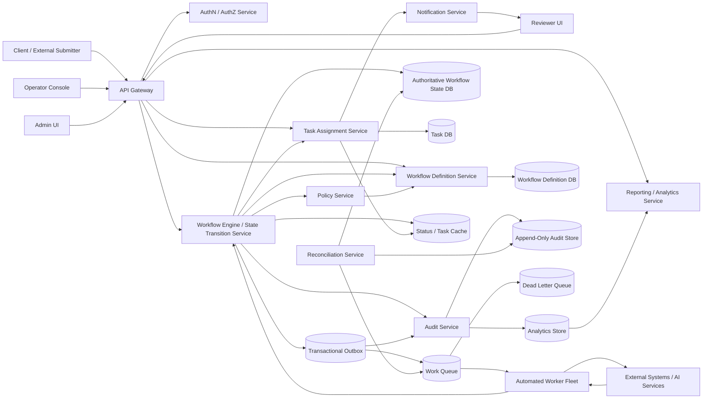
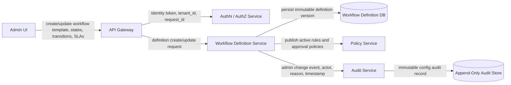
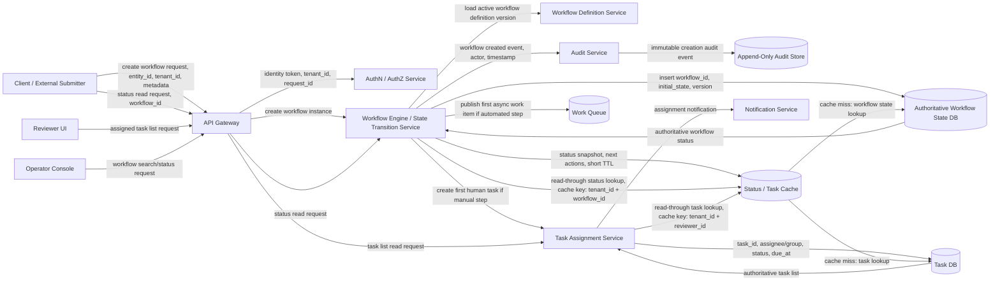
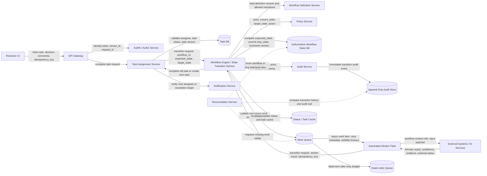
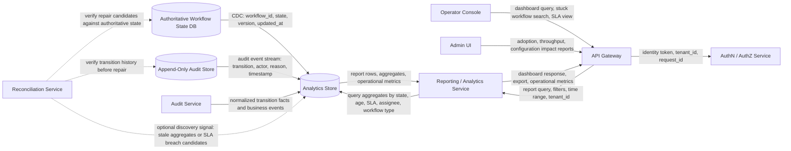

# Workflow Automation Platform with Human Review

## System Design Request
Design a Workflow Automation Platform with Human Review.

The key concept is an entity moving through states with controlled transitions. The entity may be physical or digital, but the platform must maintain an authoritative lifecycle, enforce valid state transitions, preserve auditability, and support recovery when workflows become stuck or inconsistent.

Physical examples include:

- Trading card grading, such as Received → Assigned → Grading → QA → Published → Vaulted → Shipped
- Warehouse inventory, such as Received → Stored → Picked → Packed → Shipped
- Evidence management, such as Collected → Reviewed → Approved → Archived

Digital examples include:

- Loan application, such as Submitted → Under Review → Approved → Funded
- Insurance claim, such as Opened → Investigated → Approved → Paid
- Contract review, such as Drafted → Legal Review → Approved → Executed
- Due diligence request, such as Created → AI Analysis → Human Review → Approved → Report Generated

The system should support intake, validation, assignment, automated pre-checks, human review, quality approval, status tracking, publishing results, audit trails, retries, reconciliation, and failure recovery.

The design should discover requirements around primary users, workflow states, ownership of state, approval gates, correctness requirements, SLA expectations, throughput, retry behavior, idempotency needs, chain-of-custody requirements, auditability, notification needs, reporting needs, and operator recovery from stuck or inconsistent workflows.

The design should account for both AI-assisted steps and human-in-the-loop decisions while preserving traceability, correctness, and operational control.

## AI Assisted Prompt
You are designing a platform where an entity moves through a controlled lifecycle. The entity may be physical, such as a trading card, warehouse item, or piece of evidence, or digital, such as a loan application, insurance claim, contract, or due diligence request.

Focus on the shared platform problem rather than a single domain: authoritative state management, controlled transitions, human review, automated checks, audit history, assignment, retries, reconciliation, reporting, and operational recovery.

## Start

### Functional Requirements

#### In Scope

- Create workflow definitions with ordered states, valid transitions, required approvals, and automated steps.
- Create workflow instances for a specific entity, such as a card, loan application, claim, contract, or due diligence request.
- Track each entity through an authoritative lifecycle state.
- Enforce controlled state transitions so entities cannot skip required steps.
- Assign work to humans, teams, or automated workers.
- Support AI-assisted or rules-based pre-checks before human review.
- Allow authorized reviewers to approve, reject, request changes, or escalate work.
- Maintain a full audit trail of every state transition, decision, actor, timestamp, and reason.
- Expose status APIs and UI views for users, reviewers, and operators.
- Support notifications when work is assigned, blocked, failed, overdue, or completed.
- Support retries, dead-letter handling, reconciliation, and operator repair for stuck workflows.
- Support reporting on workflow throughput, aging, bottlenecks, SLA breaches, and completion rates.

#### Out of Scope

- Domain-specific decision logic, such as deciding the actual card grade, loan approval criteria, or insurance payout amount.
- Building the AI model itself.
- Long-term document storage and OCR pipelines, except where documents are inputs to a workflow.
- Payment processing.
- Shipping label generation or carrier integrations, unless represented as external systems.
- Full low-code workflow builder UX.
- Cross-company workflow marketplace.

#### Primary Users

- External users who submit entities into a workflow.
- Internal reviewers who complete manual workflow steps.
- Operations teams who monitor, repair, and escalate stuck workflows.
- Administrators who configure workflow definitions, roles, policies, and SLAs.
- Downstream consumers who need final workflow results or published status.

#### Core Capabilities

- Workflow definition management.
- Workflow instance management.
- State transition engine.
- Human task assignment.
- Automated task execution.
- Audit logging.
- Notification and escalation.
- Operator recovery tooling.
- Reporting and analytics.

---

### Non-Functional Requirements

#### Scale

Assumptions for an enterprise platform:

- 500 enterprise tenants.
- 50,000 daily active users across submitters, reviewers, and operators.
- 5 million active workflow instances.
- 50 million completed workflow instances retained for audit and reporting.
- 10 million state transitions per day.
- Average of 6 to 12 transitions per workflow.
- Peak write rate: 2,000 state transition requests per second.
- Peak read rate: 20,000 status, task, and reporting requests per second.
- Read/write ratio: roughly 10:1.
- Audit events: append-only, high-volume, retained for 7 years depending on tenant policy.
- Growth assumption: 2x workflow volume year over year.

#### Availability

- Workflow status and task APIs target 99.9% to 99.95% availability.
- Audit log durability is more important than low-latency reporting.
- RTO: 30 minutes for critical workflow APIs.
- RPO: near-zero for authoritative state and audit transitions.
- Automated workers may degrade temporarily as long as workflow state remains correct.

#### Performance

- Status read p95 latency: under 200 ms.
- Task queue read p95 latency: under 300 ms.
- State transition API p95 latency: under 500 ms.
- Async automated task completion depends on task type, typically seconds to minutes.
- Reporting queries can be eventually consistent and served from materialized views.

#### Consistency

- Strong consistency is required for authoritative workflow state transitions.
- Audit events must be append-only and never silently overwritten.
- Assignment views may be eventually consistent.
- Reporting and analytics may be eventually consistent.
- Transition requests must be idempotent.
- Automated workers must tolerate duplicate messages.
- Per-workflow ordering is required. Global ordering is not required.

#### Security

- Authentication through enterprise SSO or identity provider integration.
- Authorization through tenant, role, workflow type, task assignment, and approval policy.
- Strong tenant isolation for state, audit history, and documents.
- Full auditability for all human and system actions.
- Encryption in transit and at rest.
- Sensitive fields may require masking, redaction, or field-level access controls.
- Administrative actions require elevated permissions and audit logging.

#### Observability

- Metrics for transition success rate, transition latency, workflow age, task age, queue depth, retry count, DLQ growth, worker errors, and SLA breaches.
- Logs for transition attempts, validation failures, worker execution, policy decisions, and operator repairs.
- Distributed traces across API, workflow engine, queue, worker, notification, and datastore calls.
- Business metrics for completed workflows, stuck workflows, approval rates, rejection rates, and reviewer throughput.

---

### Scale Assumptions

A rough sizing model:

```text
Tenants: 500
Daily active users: 50,000
Active workflows: 5,000,000
Completed workflows retained: 50,000,000
Transitions per active workflow: 10 average
Daily transitions: 10,000,000
Peak transition writes: ~2,000 RPS
Peak reads: ~20,000 RPS
Audit events per transition: 1 to 3
Daily audit events: 10,000,000 to 30,000,000
Average audit event size: 2 KB
Daily audit storage: 20 GB to 60 GB before compression and replication
7-year audit storage: roughly 50 TB to 150 TB before compression, indexes, and replicas
```

The most important scale dimension is not just request rate. It is the number of long-running workflow instances, the number of audit events, and the need to query operational backlogs efficiently.

---

### High-Level Architecture




#### Component Responsibilities

- API Gateway handles routing, rate limiting, request authentication, and request IDs.
- AuthN/AuthZ Service validates identity, tenant, roles, task ownership, and approval permissions.
- Workflow Definition Service owns workflow templates, allowed states, transitions, policies, and versioning.
- Workflow Engine owns authoritative workflow instance state, loads workflow definition versions, validates transitions, and writes outbox events for reliable async follow-up work.
- Policy Service evaluates whether a transition is allowed for the actor, workflow type, state, and tenant policy.
- Task Assignment Service owns human task records, queues, assignees, due dates, and task status.
- Automated Worker Fleet performs async checks, AI analysis, document verification, external API calls, and scheduled actions.
- Audit Service owns immutable audit history for every state transition and decision.
- Transactional Outbox durably records follow-up events in the same commit path as state changes so queue publishes, audit propagation, notifications, and analytics updates can be retried safely.
- Reconciliation Service detects and repairs stuck, inconsistent, or partially completed workflows.
- Notification Service sends assignment, escalation, completion, failure, and SLA breach notifications.
- Reporting Service serves operational dashboards and historical analytics from derived data.

---

### Flow-Oriented Diagrams

The high-level architecture diagram shows the full component map. The following diagrams break the system into four interview-friendly flows.

---

#### 1. Definition / Control Plane Flow

This flow defines what workflows are allowed to do. It creates the state machine, transition rules, approval policies, SLA rules, and workflow definition versions used later by live workflow instances.



Summary:

- The admin configures workflow definitions, roles, approval rules, automated steps, and SLA policies.
- The Workflow Definition Service validates that the workflow graph is well-formed before it can be activated, including terminal states, allowed transitions, required roles, approval rules, and SLA policies.
- The Definition DB is authoritative for workflow templates and immutable workflow definition versions.
- Existing workflow instances should continue using the definition version they were created with unless explicit migration is supported.
- Administrative changes are audited because definition changes affect regulated workflow behavior.

State created:

- Workflow definition.
- Workflow definition version.
- State transition rules.
- SLA policy.
- Role and approval policy.

Owner and authority:

- Workflow Definition Service owns workflow templates and versions.
- Definition DB is authoritative for workflow definitions.
- Policy Service evaluates the rules but does not own the definition source of truth.

---

#### 2. Intake + Read Flow

This flow covers creating a workflow instance and reading status or task views. Intake creates authoritative workflow state. Reads return current status, next actions, and task views from cache or authoritative stores.



Summary:

- A submitter creates a workflow instance for a specific entity, such as a card, claim, contract, or due diligence request.
- The Workflow Engine loads the correct workflow definition version and creates the initial authoritative lifecycle state.
- The engine creates either the first human task or the first async work item depending on the workflow definition.
- Status reads and task reads go through the owning service first. The Workflow Engine reads workflow status, and the Task Assignment Service reads task lists. Each service may use cache, but cache is never authoritative.
- A cache miss falls back to the State DB or Task DB.

State created:

- Workflow instance.
- Initial lifecycle state.
- Initial audit event.
- Optional human task.
- Optional async work item.
- Optional cache entry.

Owner and authority:

- Workflow Engine owns workflow instance state.
- State DB is authoritative for current workflow state.
- Task Assignment Service owns assigned work.
- Task DB is authoritative for task assignment state.
- Audit Service owns the immutable creation history.
- Cache is derived only.

Cache guidance:

- Workflow status cache key: `tenant_id + workflow_id`.
- Assigned task list cache key: `tenant_id + reviewer_id`.
- TTL: 30 to 120 seconds depending on workflow sensitivity.
- Invalidation: transition commits update or invalidate the status and task cache.

---

#### 3. Execution / Transition Flow

This is the core data-plane flow. Reviewers and automated workers request transitions, but only the Workflow Engine can commit authoritative lifecycle state changes.



Summary:

- Human reviewers and automated workers can request transitions, but they do not directly mutate authoritative lifecycle state.
- The Workflow Engine validates the current state, requested target state, definition version, actor permissions, and idempotency key.
- State transitions should be committed with optimistic concurrency or row-level locking.
- Every successful transition appends an immutable audit event.
- The engine creates the next human task or async work item based on the workflow definition.
- Reconciliation repairs stuck workflows, missing queue messages, and incomplete task creation.

State changed:

- Workflow current state.
- Workflow version.
- Task status.
- Next task or async work item.
- Audit event.
- Cache entry.

Owner and authority:

- Workflow Engine owns lifecycle transitions.
- State DB is authoritative for current state.
- Workflow Definition Service owns allowed transitions.
- Policy Service advises whether the actor may perform the action.
- Task Service owns task assignment and completion state.
- Queue is a delivery mechanism, not authoritative state.
- AI output is advisory until accepted by the Workflow Engine.

Retry and idempotency:

- Transition requests include an idempotency key.
- Duplicate requests return the original transition result.
- Workers must tolerate duplicate delivery.
- Queue retry is safe only when worker output and transition commits are idempotent.
- Lost queue messages are repaired from authoritative state and outbox/reconciliation records.

---

#### 4. Reporting / Analytics Flow

This flow serves operational dashboards, SLA views, throughput reports, and historical analytics. It is derived from authoritative workflow state and audit events.



Summary:

- Reporting is read-optimized and eventually consistent.
- The analytics store is derived from state changes, CDC records, and audit events.
- Operators use reports to find stuck workflow candidates, SLA breaches, bottlenecks, retry spikes, and aging tasks. Any repair action must still be verified against authoritative state and audit history.
- Admins use reports to understand adoption, throughput, and policy impact.
- Reporting should never become authoritative for workflow state.

State created:

- Derived reporting tables.
- Aggregates and materialized views.
- SLA breach views.
- Workflow aging metrics.
- Reviewer throughput metrics.

Owner and authority:

- Reporting Service owns derived analytics views.
- Analytics Store is authoritative only for reporting outputs, not workflow state.
- Workflow Engine and State DB remain authoritative for current state.
- Audit Store remains authoritative for historical transition history.

Operational guidance:

- Reporting can lag by seconds or minutes depending on the business requirement.
- SLA breach alerting should tolerate small reporting delays but must not miss old stuck workflows.
- Reconciliation may use reporting signals to discover candidate issues, but it must verify against authoritative state and audit history before repair.

---

### Data Model

Core entities:

```text
Tenant
- tenant_id
- name
- plan
- retention_policy

User
- user_id
- tenant_id
- identity_provider_id
- roles

WorkflowDefinition
- workflow_definition_id
- tenant_id
- name
- active_version

WorkflowDefinitionVersion
- workflow_definition_version_id
- workflow_definition_id
- version
- states
- transitions
- approval_rules
- sla_rules
- automated_steps

WorkflowInstance
- workflow_id
- tenant_id
- workflow_definition_version_id
- entity_type
- entity_id
- current_state
- current_task_id
- created_at
- updated_at
- terminal_state_reached_at
- version

Task
- task_id
- tenant_id
- workflow_id
- task_type
- assigned_to_user_id
- assigned_to_group_id
- status
- due_at
- created_at
- completed_at

TransitionEvent
- transition_event_id
- tenant_id
- workflow_id
- from_state
- to_state
- actor_type
- actor_id
- reason
- idempotency_key
- created_at

AuditEvent
- audit_event_id
- tenant_id
- workflow_id
- event_type
- actor_type
- actor_id
- payload
- created_at

WorkerExecution
- execution_id
- tenant_id
- workflow_id
- worker_type
- status
- attempt_count
- input_reference
- output_reference
- error_code
- created_at
- completed_at

OutboxEvent
- outbox_event_id
- tenant_id
- workflow_id
- event_type
- payload
- status
- retry_count
- created_at
- published_at

Notification
- notification_id
- tenant_id
- recipient_id
- workflow_id
- type
- status
- created_at
```

Relationships:

- One tenant has many workflow definitions.
- One workflow definition has many immutable versions.
- One workflow instance references exactly one workflow definition version.
- One workflow instance has many transition events.
- One workflow instance has many audit events.
- One workflow instance may have many tasks, but usually one active task per branch.
- One worker execution belongs to one workflow instance and one automated step.
- One workflow instance may have many outbox events used to reliably publish queue messages, audit propagation events, notifications, and analytics events.

---

### Ownership and Authority

This section is mandatory in this design.

| State / Data | Owner | Authoritative? | Notes |
|---|---|---:|---|
| Workflow current state | Workflow Engine | Yes | The source of truth for lifecycle state. |
| Workflow definition | Workflow Definition Service | Yes | Definitions are versioned and immutable once active. |
| Human task assignment | Task Assignment Service | Yes | Owns who should act next. |
| Audit history | Audit Service | Yes | Append-only record of transitions and decisions. |
| AI output | Automated Worker / AI Service | No | Advisory until committed by Workflow Engine. |
| Queue message | Queue | No | Delivery mechanism only. Not authoritative state. |
| Outbox event | Workflow Engine / Transactional Outbox | Yes for unpublished follow-up work | Durable bridge between state commits and async publishing. |
| Cache | Cache | No | Derived from State DB and Task DB. |
| Reporting tables | Reporting Service | No | Derived from audit/state events. |
| Notifications | Notification Service | No | Advisory communication, not workflow state. |
| External systems | External owners | Depends | External status must be reconciled before trusted. |

Key rule:

The Workflow Engine is the only component allowed to change authoritative workflow lifecycle state.

---

### State Model / Lifecycle

Example generic lifecycle:

```text
CREATED → VALIDATING → READY_FOR_ASSIGNMENT → ASSIGNED → IN_REVIEW → APPROVED → COMPLETED
                                              ↓              ↓
                                           REJECTED       NEEDS_CHANGES
                                              ↓              ↓
                                           COMPLETED      IN_REVIEW
```

Example with AI-assisted human review:

```text
CREATED
  → AI_ANALYSIS_PENDING
  → AI_ANALYSIS_RUNNING
  → AI_ANALYSIS_COMPLETE
  → HUMAN_REVIEW_PENDING
  → HUMAN_REVIEW_IN_PROGRESS
  → QA_PENDING
  → APPROVED
  → PUBLISHED
  → COMPLETED
```

Example task lifecycle:

```text
CREATED → ASSIGNED → CLAIMED → IN_PROGRESS → COMPLETED
                       ↓              ↓
                    EXPIRED       ESCALATED
                       ↓              ↓
                    REASSIGNED     REASSIGNED
```

Task lifecycle matters because workflow state and task state are related but not the same. The Workflow Engine owns lifecycle state, while the Task Assignment Service owns task assignment and task completion state.

Failure and exception states:

```text
FAILED_RETRYABLE
FAILED_TERMINAL
BLOCKED
ESCALATED
CANCELLED
TIMED_OUT
NEEDS_OPERATOR_REPAIR
```

Transition rules:

- CREATED → AI_ANALYSIS_PENDING happens after intake validation succeeds.
- AI_ANALYSIS_PENDING → AI_ANALYSIS_RUNNING happens when a worker claims the task.
- AI_ANALYSIS_RUNNING → AI_ANALYSIS_COMPLETE happens when worker output is accepted.
- AI_ANALYSIS_COMPLETE → HUMAN_REVIEW_PENDING happens when policy requires human approval.
- HUMAN_REVIEW_PENDING → HUMAN_REVIEW_IN_PROGRESS happens when a reviewer claims the task.
- HUMAN_REVIEW_IN_PROGRESS → APPROVED happens when an authorized reviewer approves.
- APPROVED → PUBLISHED happens when final result is committed to downstream systems.
- Any non-terminal state may move to ESCALATED if SLA is breached.
- Retryable automated failures move to FAILED_RETRYABLE.
- Exhausted retries move to NEEDS_OPERATOR_REPAIR or FAILED_TERMINAL.

Validation:

- Workflow Engine validates that the transition exists.
- Policy Service validates actor authorization.
- State DB concurrency control validates that the workflow has not changed since the actor read it.
- Audit Service records the transition after commit.

---

### Failure Modes

#### 1. Duplicate Transition Request

Scenario:

- Reviewer double-clicks approve or client retries after timeout.

Detection:

- Same idempotency key for the same workflow and transition.

Recovery:

- Return the original successful result.
- Do not create duplicate audit events or tasks.

Authoritative source:

- State DB and transition idempotency table.

---

#### 2. Worker Crashes Mid-Step

Scenario:

- Worker claims an AI analysis job but crashes before writing result.

Detection:

- Queue visibility timeout expires or WorkerExecution remains RUNNING past heartbeat timeout.

Recovery:

- Message becomes visible again.
- Another worker retries.
- Worker transition request uses idempotency key.

Retry safe?

- Yes, if worker output is written with deterministic execution ID or idempotency key.

---

#### 3. Lost Queue Message

Scenario:

- State transition commits but queue publish fails.

Detection:

- Outbox table has unpublished event.
- Reconciliation job finds workflows waiting for async work with no queued task.

Recovery:

- Use transactional outbox pattern.
- Relay republishes event from outbox.
- Reconciliation can regenerate missing work items from authoritative state.

Authoritative source:

- State DB and outbox table, not the queue.

---

#### 4. Audit Write Fails

Scenario:

- State transition commits but audit event is not written.

Preferred design:

- Commit state transition and audit event in the same database transaction when possible.
- Or use transactional outbox to guarantee audit event publication.

Recovery:

- Reconciliation compares transition events, outbox events, and the audit store.
- Missing audit events can only be rebuilt if the transition event was durably committed in the same transaction as the authoritative state change or captured through the transactional outbox.
- If neither the transition event nor outbox event exists, the system should treat the workflow as requiring operator investigation rather than inventing an audit record.

Important:

- For regulated workflows, a transition should not be considered complete unless audit capture is durable.

---

#### 5. Reviewer Approves Stale Task

Scenario:

- Reviewer opens task while workflow is in REVIEW, but another reviewer already completed it.

Detection:

- Expected state or task version does not match current state.

Recovery:

- Reject stale transition.
- UI refreshes latest workflow status.

Authoritative source:

- State DB version field.

---

#### 6. Database Outage

Scenario:

- Authoritative State DB is unavailable.

Impact:

- State transitions must stop.
- Reads may serve stale cached status if acceptable.
- Human approvals should not be accepted unless they can be durably committed.

Recovery:

- Fail over database if supported.
- Replay outbox events after recovery.
- Reconcile in-flight workers and task assignments.

Tradeoff:

- Prefer correctness over accepting writes during DB outage.

---

#### 7. Cache Miss Storm

Scenario:

- Cache expires for large task lists or status views.

Detection:

- Sudden drop in cache hit rate and spike in DB reads.

Recovery:

- Use request coalescing.
- Add short TTL jitter.
- Rate-limit expensive list queries.
- Precompute common dashboard views.

Authoritative source:

- State DB and Task DB.

---

#### 8. Stuck Workflow

Scenario:

- Workflow remains in AI_ANALYSIS_RUNNING for too long.

Detection:

- SLA monitor scans for state age greater than allowed threshold.

Recovery:

- Retry if safe.
- Escalate to operator if retry budget is exhausted.
- Move workflow to NEEDS_OPERATOR_REPAIR with reason code.

Repair:

- Operator can requeue automated step, assign manual review, cancel workflow, or force transition with elevated permissions and audit record.

---

#### 9. Regional Outage

Scenario:

- One region loses workers, queue, or database access.

Recovery strategy:

- Active-passive for authoritative state if strong consistency is required.
- Active-active reads for reporting and status where stale data is acceptable.
- Workers can be restarted in another region after queue and state failover.

Tradeoff:

- Strong workflow correctness makes active-active writes harder.

---

### Tradeoffs and Alternatives

#### SQL vs NoSQL for Authoritative State

Recommendation:

- Use SQL for authoritative workflow state because transitions need constraints, transactions, optimistic concurrency, and relational queries.

Alternative:

- Use NoSQL for massive scale and flexible workflow payloads, but transition correctness and reporting become harder.

Decision:

- SQL for state and tasks.
- Object storage for large payloads.
- Analytics warehouse for reporting.

---

#### Event Sourcing vs Current State Table

Option 1: Current state table plus append-only transition events.

- Easier operational model.
- Faster status reads.
- Good fit for most enterprise workflow platforms.

Option 2: Full event sourcing.

- Strong audit and replay model.
- More complex reads and migrations.
- Harder for teams unfamiliar with event-sourced systems.

Recommendation:

- Use a current state table plus append-only transition events and audit events.
- This gives strong operational simplicity while preserving history.

---

#### Queue-Based Orchestration vs Dedicated Workflow Engine

Option 1: Build orchestration around DB state, queues, and workers.

- More control.
- Easier to customize for domain-specific authorization and audit.
- More engineering ownership.

Option 2: Use Temporal, Cadence, Camunda, or Step Functions.

- Built-in orchestration, retries, timers, and visibility.
- May be harder to fit strict human approval, tenant-specific policy, and custom audit requirements.

Recommendation:

- For an interview, present the platform as a custom workflow engine with clear state ownership.
- Mention Temporal or Camunda as alternatives depending on build-vs-buy constraints.

---

#### Strong Consistency vs Availability

Recommendation:

- State transitions favor consistency over availability.
- Status reads and reports can favor availability with stale data.

Reason:

- Incorrect approval, skipped review, or missing audit history is worse than temporarily failing a write.

---

#### Sync vs Async

Recommendation:

- Synchronous for state transition validation and commit.
- Asynchronous for automated work, notifications, reporting, exports, and external system calls.

Reason:

- Keep authoritative state changes controlled and fast.
- Avoid blocking user requests on slow AI or external services.

---

### Observability

#### Technical Metrics

- API request rate.
- API error rate.
- p50, p95, p99 latency by endpoint.
- State transition success rate.
- State transition validation failure rate.
- DB connection pool saturation.
- Lock contention or optimistic concurrency conflict rate.
- Queue publish failures.
- Worker execution latency.
- Worker error rate.

#### Business Metrics

- Workflows created per day.
- Workflows completed per day.
- Completion rate by workflow type.
- Approval, rejection, and escalation rates.
- Average time in each state.
- SLA breach rate.
- Reviewer productivity.
- AI recommendation acceptance rate.

#### Operational Metrics

- Queue depth by task type.
- Oldest message age.
- Retry rate.
- DLQ growth.
- Stuck workflow count.
- Workflows in NEEDS_OPERATOR_REPAIR.
- Cache hit rate.
- Notification failure rate.
- Reconciliation repair count.

#### Alerts

- State transition error rate exceeds threshold.
- Queue age exceeds SLA.
- DLQ growth exceeds threshold.
- Audit write failures occur.
- Stuck workflow count spikes.
- Database latency or saturation exceeds threshold.
- SLA breach rate increases.

---

### Cost

#### Main Cost Drivers

- Authoritative database writes and indexes for high-volume transitions.
- Audit event retention for many years.
- Reporting and analytics storage.
- Worker compute for automated checks and AI analysis.
- External AI API calls.
- Notification volume.
- Cross-region replication.

#### Cost Optimizations

- Keep large payloads out of the relational state database.
- Store large documents, AI outputs, and attachments in object storage.
- Use compact audit event payloads with references to large objects.
- Partition audit and transition tables by tenant and time.
- Index active workflow queries carefully by tenant, state, assignee, due_at, and updated_at because operational backlog queries can become expensive at scale.
- Move old audit events to cheaper storage tiers while preserving query access.
- Use materialized views for common reports instead of repeatedly scanning raw audit history.
- Batch notification and reporting updates where real-time behavior is not required.
- Use cheaper models or rules engines for low-risk automated checks before escalating to expensive AI calls.

#### Biggest Cost Driver

The biggest long-term cost driver is audit and event retention, followed by AI/worker execution cost if the platform relies heavily on external AI analysis.

First optimization:

- Separate hot operational state from cold audit history.
- Keep current workflow state small and fast.
- Move historical events into partitioned, compressed, lower-cost storage with reporting views.

---

### Final Design Summary

This system is not just a database schema around state management. The core challenge is building a reliable workflow orchestration platform where physical or digital entities move through controlled lifecycle states.

The most important design decisions are:

- The Workflow Engine owns authoritative lifecycle state.
- The Workflow Definition Service owns valid states and transitions.
- The Task Service owns human assignment state.
- The Audit Service owns immutable history.
- Queues, caches, notifications, and reporting stores are derived or delivery mechanisms, not authoritative state.
- AI outputs are advisory until the Workflow Engine commits a transition.
- State transitions must be strongly consistent, idempotent, authorized, and audited.
- Async work must be retryable and recoverable through reconciliation.
- Operators need tooling to detect and repair stuck workflows safely.

A strong interview answer should repeatedly clarify: what state changed, who owns it, who is authoritative, whether retry is safe, and how state is repaired when something goes wrong.
